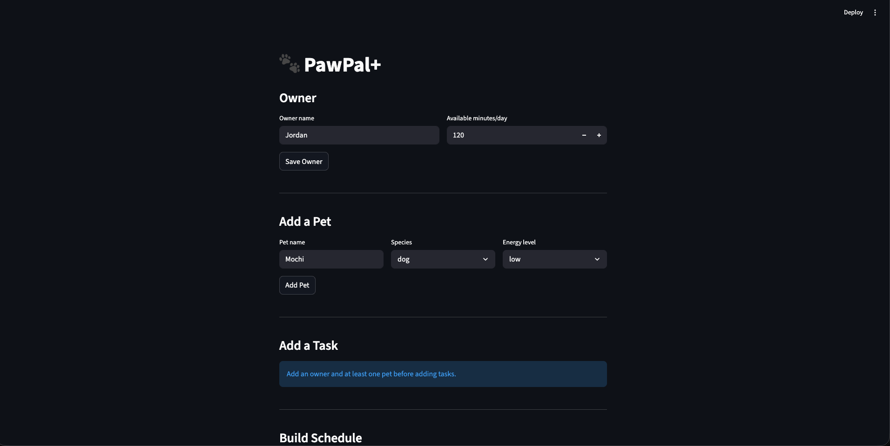

# PawPal+

**PawPal+** is a Streamlit app that helps busy pet owners stay consistent with pet care. Enter your pets, define their tasks, and PawPal+ generates an optimized weekly schedule — automatically handling priorities, time limits, recurrence, and conflicts across multiple pets.

## Features

- **Priority-based scheduling:** tasks ranked high/medium/low; higher-priority tasks fill the day first
- **Time-anchored tasks:** tasks with a `preferred_time` are placed before untimed ones, sorted chronologically
- **Special-needs priority boost:** tasks matching a pet's special needs receive a +1 priority score at scheduling time
- **Daily & weekly recurrence:** completed tasks automatically generate a follow-up due the next day (daily) or next week (weekly); one-time tasks are not repeated
- **Due-date awareness:** tasks with a future due date are silently skipped until that date arrives, preventing double-scheduling after recurrence
- **Multi-pet conflict detection:** flags days where combined task time across all pets exceeds the owner's daily time limit
- **Time-slot conflict warnings:** detects when two or more tasks across any pet are assigned the exact same start time
- **Conflict resolution:** automatically bumps the lowest-priority task from an overbooked day to the next day
- **Dropped task tracking:** tasks that don't fit the daily budget are recorded and surfaced so nothing is silently lost
- **Consolidated task suggestions:** identifies task titles that appear across multiple pets' schedules as candidates to batch together
- **Scheduling explanations:** every scheduled task logs a human-readable reason showing its priority, duration, day, and assigned time

## Smarter Scheduling

Three features were added to `pawpal_system.py` to make the scheduler more intelligent:

**Automatic task recurrence**: when `task.mark_complete()` is called on a `daily` or `weekly` task, it now returns a new `Task` instance due on the next occurrence (today + 1 day for daily, today + 7 days for weekly). One-time tasks return `None`. Callers add the returned task back to the pet to keep the schedule rolling forward.

**Due-date awareness**: `Task` has a new optional `due_date` field. `is_due_today()` respects it: a task with a future `due_date` is silently skipped by the scheduler until that date arrives. This prevents a just-completed recurring task from being re-scheduled the same day its successor is created.

**Time-slot conflict detection**: `OwnerScheduler.detect_time_slot_conflicts()` scans every day's plan across all pets and reports any time slot where two or more tasks overlap. It returns plain warning strings rather than raising exceptions, so the app stays running and the owner can decide how to resolve the clash. `get_time_slot_conflict_report()` formats those warnings into a single printable string.

## Testing PawPal+

### Running the tests

```bash
python -m pytest test/
```

To run a single test by name:

```bash
python -m pytest test/test_pawpal.py::test_mark_complete_changes_status
```

### What the tests cover

| Area | Tests |
|---|---|
| **Sorting correctness** | Tasks with `preferred_time` are sorted chronologically; timed tasks always schedule before untimed ones; untimed tasks sort high → medium → low priority |
| **Recurrence logic** | Daily tasks produce a next task due +1 day; weekly tasks produce one due +7 days; one-time tasks return `None`; recurred tasks preserve title, duration, and priority |
| **Conflict detection** | Daily time-budget conflicts are reported when combined pet tasks exceed `available_time_per_day`; time-slot conflicts are flagged when two tasks share the same start time; no false positives for a single pet with one task |
| **Task basics** | Tasks start incomplete; `mark_complete` sets the flag; pets track task counts correctly |

### Confidence Level

★★★★☆ (4/5)

The core scheduling behaviors — priority sorting, recurrence, and conflict detection — are all verified and passing. Confidence is held back from 5 stars because the time-slot conflict check assumes a fixed 08:00 start with no overlap handling across a real wall-clock range, and the UI layer (`app.py`) has no automated test coverage.

## Getting started

### Setup

```bash
python -m venv .venv
source .venv/bin/activate  # Windows: .venv\Scripts\activate
pip install -r requirements.txt
```

### How to use

1. Enter your name and available minutes per day.
2. Add one or more pets (name, species, age, energy level, special needs).
3. Add tasks to each pet (title, duration, priority, frequency, optional preferred time).
4. Click **Generate Schedule** to produce a full weekly plan.
5. Review the schedule, conflict warnings, and scheduling explanations.

### Demo        

<a href="/course_images/ai110/your_screenshot_name.png" target="_blank"></a>
